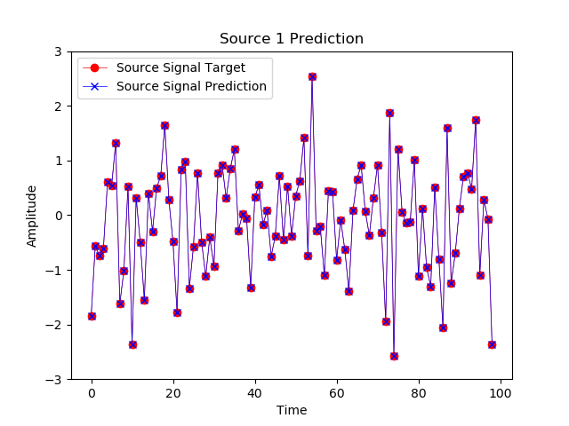

Blind Signal Separation (Independent Component Analysis) of Signals with High Velocity (light) or for Short Distance Propagation

No prior on source signal and no signal interdependence prior assumed. 

Pmt is signal amplitude at receiver m and time (or time×frequency) t

Umn is inverse square of distance signal loss from transmitter n to receiver m

Qnt is signal amplitude at source n and time (or time×frequency) t

P=UQ (matrix factorization model)

source n has location Snx,Sny,Snz

receiver m has location Rmx,Rmy,Rmz

the low rank factorization can be uniquely identified if the matrix U is parameterized only by the unknown transmitter locations

this is because Umn=||Sn-Rm||^-1 (corrected to -1 for amplitude decay)

Published in Optics and Photonics for Information Processing XX
Blind source separation of inverse square law signals with no prior
Alexander Glandon, Khan M. Iftekharuddin, Old Dominion Univ. (United States); Sasanka Adikari, Clarkson Univ. (United States)

Based on earlier work:
Glandon, Alexander M. "Recurrent neural networks and matrix methods for cognitive radio spectrum prediction and security." (2017).
